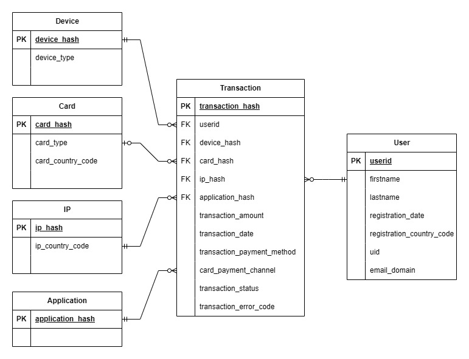

# Random Telecom Payments Generation

## Overview

Randomly simulated data is particularly useful when it's real world counterpart is hard access due to complexity, privacy and security reasons. Moreover, randomly simulated data has additional benefits including reproducibility, scalability and controllability. 

This application aims to simulate telecommunication payments using random number generation. It includes typical transaction level relationships and behaviours amongst the user, device, ip, and card entities. It can be used in place of real world telecommunication payments for prototyping solutions and as an education tool. 

### Master File

A stable master version of the Random Telecom Payments data can be found on Kaggle here:

* https://www.kaggle.com/datasets/oislen/randomtelecompayments

## Data Model

The underlying data model present in the simulated telecommunication payments is displayed below. 

For a more detailed account of each column in the dataset see the data dictionary:

* https://github.com/oislen/RandomTelecomPayments/blob/main/doc/data_dictionary.csv

## Running the Application

The following command can be used to execute the application:

     python3 RandomTelecomPayments/scripts/main.py --n_users 5000 --randomseed 1 --nitr 2

The application works by first generating user level telecom payments data. Once generated, the user level data is exploded to transaction level, and any inconsistencies within the data model are removed. Finally, the transaction status and error codes are generated using underlying features within the transaction level data.

### Parameters

* **n_users** - integer, the number of users to generate random telecom payments data for, default is 100.
* **use_random_seed** - integer, whether to run the random telecom payments data generation with or without a random seed set for reproducible results; must be 0 or 1.
* **n_itr** - integer, the number of random telecom payments data batches to generate; must be at least 1. The python multiprocessing library is used to run each in parallel across all available cores.

### Docker Image

The latests image can be found on dockerhub here:
* https://hub.docker.com/repository/docker/oislen/randomtelecompayments/general
